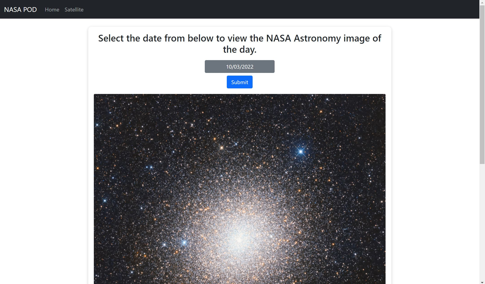

# React NASA website

This is a react website that utilises [NASA APIs](https://api.nasa.gov/), to display the Astronomy Picture of the Day and a satellite image over your location.

## Table of contents

- [Overview](#overview)
  - [The challenge](#the-challenge)
  - [Screenshot](#screenshot)
  - [Links](#links)
- [My process](#my-process)
  - [Built with](#built-with)
  - [What I learned](#what-i-learned)
  - [Continued development](#continued-development)
  - [Useful resources](#useful-resources)
- [Author](#author)

## Overview

### The challenge

Users should be able to:

- View the optimal layout for the component depending on their device's screen size
- Select a date to view the image taken on that day.
- Get a satellite image over there location.

### Screenshot



### Links

- Solution URL: [Add solution URL here](https://github.com/Ishi1834/react-nasa-app)
- Live Site URL: [Add live site URL here](https://ishi1834.github.io/react-nasa-app)

## My process

### Built with

- Bootstap 5
- JavaScript
- Mobile-first workflow
- [React](https://reactjs.org/) - JS library

### What I learned

How to use the useEffect hook to make an API requests when the page loads.

To see how you can add code snippets, see below:

```js
useEffect(() => {
  fetch(`https://api.nasa.gov/planetary/apod?api_key=${config.api.NASA}`)
    .then((res) => {
      if (res.ok) {
        return res.json();
      } else {
        console.log("Not successful");
      }
    })
    .then((data) => {
      console.log(data);
      setLoadingdata(false);
      setApiData(data);
    });
}, []);
```

### Continued development

I used the react testing the library to test that the components were working when the page loaded. The tests that I ran only show the initial state of my component and don't account for the change in state after the fetch request is resolved. I plan on learning how to mock API requests requests so I can fully test the component.

### Useful resources

- [API requets](https://www.youtube.com/watch?v=cuEtnrL9-H0) - How to make fetch requests.
- [Tests](https://www.youtube.com/watch?v=GLSSRtnNY0g) - How to test react components.

## Author

- Website - [Ismail](https://ismail-dev-portfolio.herokuapp.com/)
